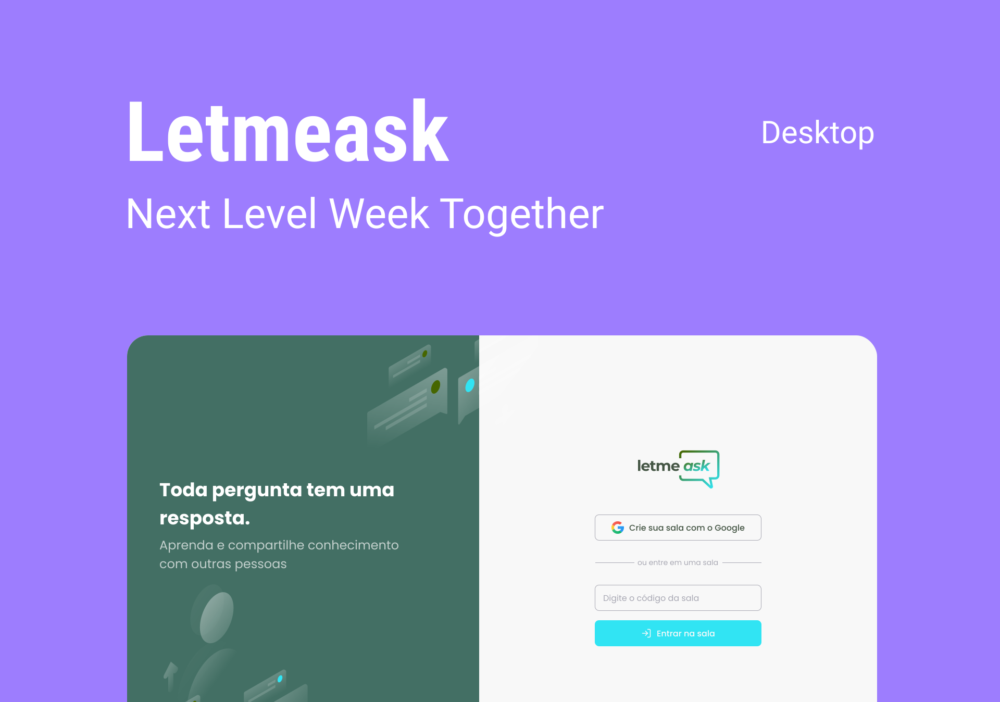

# Letmeask 

 
   > **Project:** _NLW [Rocketseat]_
    **UI Designer:** _Rebecca Gonzalez_
    **Figma Project:** _[Letmeask Figma][Link]_
    **GitHub Project:** _[Letmeask Rocketseat][GitRocketseat]_

 [Link]: https://www.figma.com/file/u0BQK8rCf2KgzcukdRRCWh/Letmeask/duplicate?node-id=45%3A29835

 [Rocketseat]: https://rocketseat.com.br

 [GitRocketseat]: https://github.com/rocketseat-education/nlw-06-reactjs
